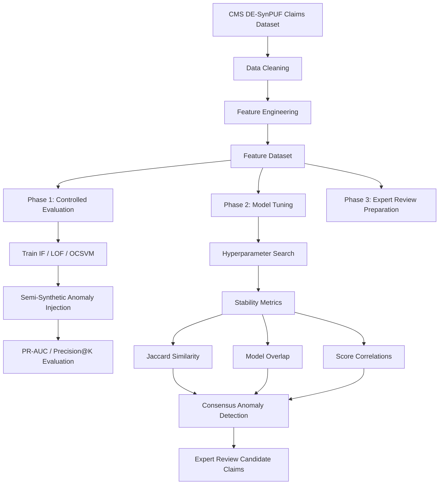

# Unsupervised Anomaly Detection in Medicare Outpatient Claims

A reproducible machine learning pipeline for detecting anomalous healthcare claims using **Isolation Forest, Local Outlier Factor (LOF), and One-Class Support Vector Machine (OCSVM)**.

This repository accompanies the MSc Data Science thesis:

**“Unsupervised Anomaly Detection in Medicare Outpatient Claims: A Reproducible Comparative Study of Isolation Forest, LOF, and One-Class SVM.”**

---

# Project Overview

Healthcare insurance systems process millions of claims annually and are vulnerable to irregular billing behaviors such as:

- upcoding
- phantom billing
- duplicate claims
- abnormal reimbursement patterns

Traditional rule-based systems struggle to detect evolving patterns in high‑dimensional claims data.

This project develops a **reproducible unsupervised anomaly detection pipeline** to identify suspicious claims using publicly available Medicare synthetic claims data.

The study evaluates three classic anomaly detection algorithms:

• Isolation Forest (IF)  
• Local Outlier Factor (LOF)  
• One‑Class Support Vector Machine (OCSVM)

The pipeline follows a **three‑phase research design** combining controlled evaluation and real‑world unsupervised analysis.

---

# Research Contributions

This repository provides:

### 1. Reproducible anomaly detection pipeline

- Public dataset (CMS DE‑SynPUF)
- Transparent preprocessing steps
- Documented feature engineering
- Fully reproducible notebooks

---

### 2. Controlled algorithm comparison

Three unsupervised algorithms are evaluated under identical conditions:

- same dataset
- same engineered features
- same anomaly injection protocol
- same evaluation metrics

This ensures a **fair and interpretable comparison**.

---

### 3. Dual evaluation framework

The study evaluates models under two complementary settings:

**Controlled evaluation**
- semi‑synthetic anomaly injection
- precision‑recall metrics

**Unsupervised deployment scenario**
- hyperparameter tuning
- stability analysis
- model overlap diagnostics

---

### 4. Consensus anomaly detection

A consensus strategy identifies high‑confidence anomalies detected by multiple models, providing better candidates for **expert review workflows**.

---

# Methodology Overview



---

# Repository Structure

```
notebooks/
    01_medical_claims_anomaly_pipeline.ipynb
    02_model_tuning_and_consensus_analysis.ipynb

data/
    processed/

models/

outputs/
    phase1_data_preparation/
    phase2_controlled_evaluation/
    phase3_expert_review/
    tuning_results/

docs/
```

---

# Notebooks

## Main pipeline notebook

`notebooks/01_medical_claims_anomaly_pipeline.ipynb`

Implements:

- data cleaning
- feature engineering
- anomaly injection
- model training
- controlled evaluation

---

## Model tuning and consensus analysis

`notebooks/02_model_tuning_and_consensus_analysis.ipynb`

Implements:

- hyperparameter tuning
- stability analysis
- anomaly overlap diagnostics
- consensus anomaly detection

---

# Dataset

This project uses the **CMS DE‑SynPUF 2010 Medicare Outpatient Claims dataset**, a publicly available synthetic dataset preserving statistical properties of real Medicare claims.

Source:

Centers for Medicare & Medicaid Services (CMS)

---

# Reproducibility

## Environment

Recommended Python version

```
Python 3.10+
```

Install dependencies:

```
pip install -r requirements.txt
```

---

## Run order

1️⃣ Run the main pipeline notebook

```
notebooks/01_medical_claims_anomaly_pipeline.ipynb
```

This notebook performs:

- preprocessing
- feature engineering
- anomaly injection
- model training
- evaluation

---

2️⃣ Run the tuning notebook

```
notebooks/02_model_tuning_and_consensus_analysis.ipynb
```

This notebook performs:

- model tuning
- stability analysis
- overlap analysis
- consensus anomaly extraction

---

# Key Outputs

The pipeline generates outputs including:

- PR‑AUC comparison plots
- anomaly score distributions
- model overlap matrices
- consensus anomaly datasets
- anomaly diagnostics

These artifacts support both **quantitative evaluation** and **expert review preparation**.

---

# Technologies

Python libraries used:

- pandas
- numpy
- scikit‑learn
- scipy
- matplotlib
- seaborn
- pyarrow

---

# Author

Nyan Lynn Htet  
MSc Data Science  
INTI International University

---

# License

MIT License
