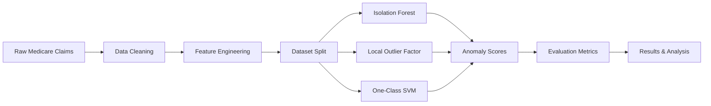
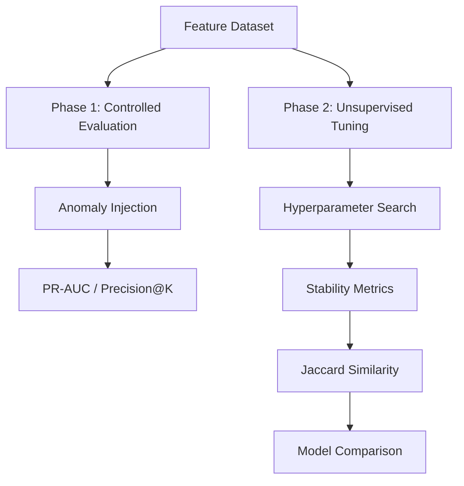
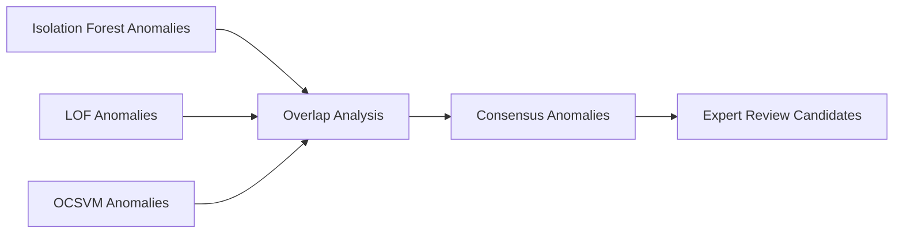

# Research Diagrams

These diagrams describe the conceptual architecture of the project.
GitHub can render these automatically using Mermaid.

---

# 1. Overall Research Pipeline

---

# 2. Dual Evaluation Framework

---

# 3. Consensus Anomaly Detection

---

# Project Description

This study develops a reproducible anomaly detection framework for Medicare outpatient claims using publicly available synthetic claims data. Three classical unsupervised algorithms—Isolation Forest, Local Outlier Factor, and One‑Class Support Vector Machine—are evaluated using a dual‑phase experimental design.

First, semi‑synthetic anomaly injection enables controlled performance evaluation using precision‑recall metrics. Second, models are tuned on unlabeled claims to simulate real‑world deployment conditions, where stability‑based evaluation metrics such as Jaccard similarity and anomaly rate consistency are used to assess reliability.

The framework further introduces consensus anomaly detection across multiple algorithms to prioritize high‑confidence anomalies for expert review. By combining reproducible pipelines, controlled benchmarking, and stability‑based unsupervised evaluation, the study contributes a practical and transparent methodology for anomaly detection in healthcare insurance claims.
